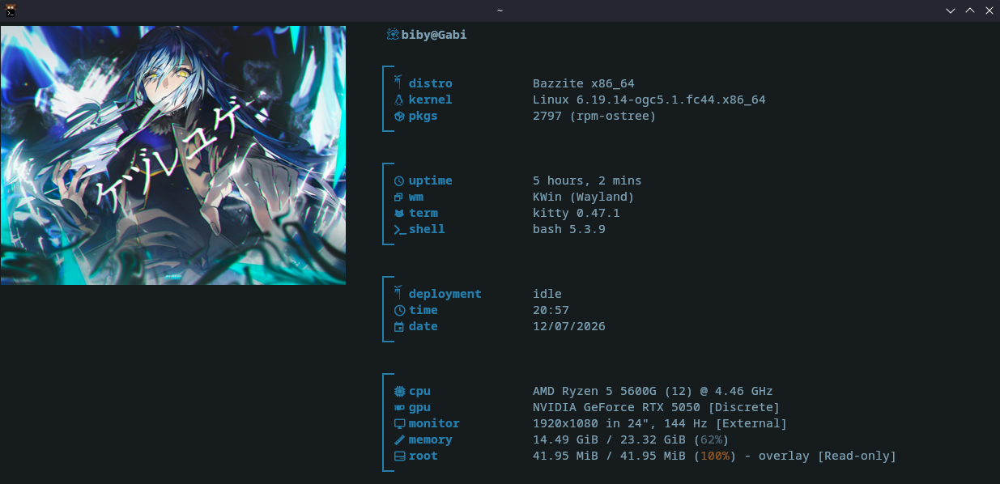

# 🖥️ Criando um Ícone Personalizado para o Terminal (Fastfetch)

Este guia mostra como transformar uma imagem PNG em um ícone de fonte (`\uE900`) para usar no terminal junto com o Fastfetch.

---

# 📌 Fluxo do processo

```

Imagem PNG
↓
Converter PNG para SVG
↓
Preparar SVG como vetor
↓
Converter SVG para fonte (TTF/OTF)
↓
Adicionar Unicode (ex: E900)
↓
Instalar fonte no Linux
↓
Configurar Terminal
↓
Usar no Fastfetch

```
# 1. Escolher um icone

Entre no site e escolha um icone da sua preferencia.

## Sites para escolher o icone.

### Opção 1:
🔗 Link:
https://www.flaticon.com/search?word=cobra

# 2. Converter PNG para SVG

A imagem precisa ser transformada em vetor.

## Sites para converter PNG → SVG

### Opção 1:
🔗 Link:
https://convertio.co/pt/download/89f126be126e98d1def67476cb25230d95f572/

```

# 3. Preparar o SVG como ícone vetorial

O SVG precisa ser formado por caminhos (`path`).

🔗 Site:
```
https://icomoon.io/app/#/select/font

```
Passos:

1. Abrir o site

2. Clique:

```

Import Icons

```

3. Escolha seu SVG

4. Clique no ícone

5. Vá em:

```

Font → Generate Font

```

6. Defina o código Unicode:

Exemplo:

```

E900

```

Resultado:

```

\uE900

````

7. Baixe a fonte

---

# 4. Instalar a fonte no Linux

```
Passos:

1. Abra o seu Kitty

Criar pasta de fontes:

```bash
mkdir -p ~/.local/share/fonts
````

2. Coloque o icomoon.zip na pasta /var/home/SEU-USUARIO/.local/share/fonts/

3. dentro do fonts extraia seu o arquivo icomoon.zip

# 5. Verificar se o ícone existe

Ver fontes instaladas:

```bash
fc-list
```

Verificar Unicode:

```bash
fc-query --format='%{charset}\n' ~/.local/share/fonts/icomoon/fonts/icomoon.ttf
```
Se aparecer:

```
e900
```

A fonte possui o ícone.

---
# 6. Testar o ícone

Terminal:

```bash
echo -e "\ue900"
```

Se aparecer o desenho:

✅ Fonte funcionando

---

# 7. Adicionar no Fastfetch

Arquivo:

```
~/.config/fastfetch/config.jsonc
```

Adicionar:

```json
{
    "type": "custom",
    "format": "\u001b[34m \uE900 \u001b[0m\u001b[1mSEU-USUARIO\u001b[0m"
}
```

Resultado esperado:

```
[Ícone] SEU-USUARIO
```

---

# 🛠️ Problemas comuns

## Aparece um quadrado □

Causa:

* Terminal usando outra fonte
* Ícone não está no Unicode correto
* Fonte não foi instalada

Solução:

Verificar:

```bash
fc-query --format='%{charset}\n' fonte.ttf
```

---

## Aparece outro símbolo

Causa:

O ícone foi colocado em outro código.

Exemplo:

```
E901
E902
F001
```

e não:

```
E900
```

---

# 📂 Local recomendado

Fontes:

```
~/.local/share/fonts/
```

Fastfetch:

```
~/.config/fastfetch/
```

---

# Resultado final

Imagem personalizada:

```
PNG
 ↓
SVG
 ↓
TTF
 ↓
\uE900
 ↓
Terminal
 ↓
Fastfetch
```

Agora seu terminal possui um ícone personalizado.

```
## 📸 Pré-visualização



---

Esse README já está no formato para você colocar no GitHub ou deixar salvo na sua pasta de configuração do Fastfetch.
```
