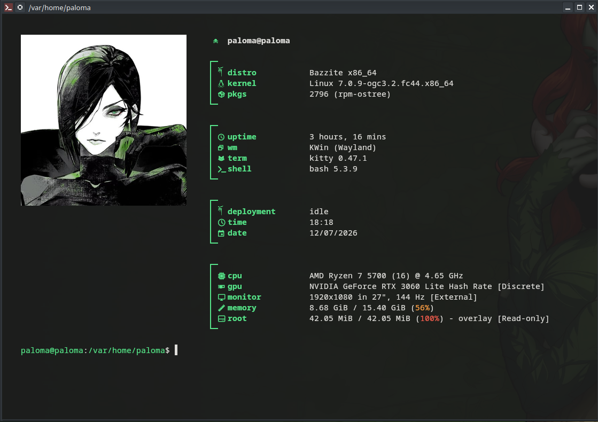

# 📊 Minha Configuração Personalizada do Fastfetch

Bem-vindo ao meu repositório de customização do **Fastfetch**! Criei este espaço para compartilhar o meu arquivo `config.jsonc` estruturado para o terminal **Kitty** no **Bazzite** (or qualquer outra distribuição Linux), focado em um visual limpo, moderno e com boa usabilidade.

Sinta-se à vontade para usar como inspiração, clonar ou modificar para deixar o terminal com a sua cara!

---

## 📸 Pré-visualização



---

## ⚙️ Pré-requisitos

Antes de aplicar a configuração, certifique-se de ter instalado:
* **Fastfetch** (versão estável mais recente)
* Um terminal com suporte a imagens via protocolo Kitty (Recomendado: **Kitty**)
  > 🚀 **Dica:** Se você ainda não tem ou não sabe como configurar, veja o meu **[Guia Completo de Instalação e Configuração do Kitty Terminal](https://github.com/PalomaGLima/Kitty-no-Bazzite)**.
* Uma fonte com suporte a ícones instalada no sistema (Recomendado: **JetBrainsMono Nerd Font** ou qualquer outra [Nerd Font](https://www.nerdfonts.com/))

---

## 🚀 Como Instalar e Usar

Siga os passos abaixo para aplicar esta configuração no seu sistema:

### 1. Clonar o Repositório
Abra o seu terminal e clone este repositório na sua máquina:
```bash
git clone [https://github.com/SEU_USUARIO/NOME_DO_REPOSITORIO.git](https://github.com/SEU_USUARIO/NOME_DO_REPOSITORIO.git)
cd NOME_DO_REPOSITORIO

```

*(Substitua `SEU_USUARIO` e `NOME_DO_REPOSITORIO` pelos seus dados reais do GitHub)*

### 2. Fazer Backup da sua Configuração Atual (Segurança)

Caso você já tenha alguma configuração antiga do Fastfetch, guarde-a antes de substituir:

```bash
mkdir -p ~/.config/fastfetch
mv ~/.config/fastfetch/config.jsonc ~/.config/fastfetch/config.jsonc.bak 2>/dev/null || true

```

### 3. Aplicar o Novo `config.jsonc`

Copie o arquivo deste repositório diretamente para a sua pasta de configurações do Fastfetch:

```bash
cp config.jsonc ~/.config/fastfetch/config.jsonc

```

---

## 🖼️ Configurando a Imagem de Logo

No arquivo `config.jsonc`, a linha do logo está configurada para procurar um arquivo genérico. Para que a sua imagem apareça corretamente ao lado das informações do sistema, você tem duas opções:

* **Opção 1 (Mais fácil):** Pegue a imagem `.jpg` de sua escolha, mude o nome dela exatamente para `imagem-de-sua escolha.jpg` e salve-a dentro da pasta `~/.config/fastfetch/`.
* **Opção 2:** Salve a imagem com o nome que quiser na pasta do Fastfetch e mude o caminho dentro do `config.jsonc` na linha `"source"`:
```json
"source": "~/.config/fastfetch/NOME_DA_SUA_IMAGEM.jpg"

```


---

## ⚡ Como Executar

### Execução Simples

Para testar imediatamente no seu terminal, basta rodar:

```bash
fastfetch

```

### Usuários do Bazzite / Fedora Silverblue

Se você estiver utilizando o **Bazzite** e o sistema insistir em carregar o layout azul padrão da distro, force o uso do seu arquivo local desfazendo as variáveis do sistema com o comando:

```bash
env -u FASTFETCH_CONFIG fastfetch -c ~/.config/fastfetch/config.jsonc

```

### Inicialização Automática (Opcional)

Se quiser que essa tela apareça lindamente **toda vez que você abrir o seu terminal Kitty**, adicione o comando ao final do seu arquivo `~/.bashrc`:

1. Abra o arquivo:
```bash
nano ~/.bashrc

```


2. Adicione esta linha no final de tudo:
```bash
clear && env -u FASTFETCH_CONFIG fastfetch -c ~/.config/fastfetch/config.jsonc

```


3. Salve com `Ctrl + O` -> `Enter` -> saia com `Ctrl + X` e recarregue com `source ~/.bashrc`.

---

## 🎨 Personalização Adicional

Dentro do arquivo `config.jsonc`, você pode facilmente alterar:

* **Nome de Usuário:** No primeiro módulo customizado, substitua o texto `SEU_USUARIO` pelo seu nome ou apelido para aparecer ao lado do ícone `☠`.
* **Módulos:** Ative ou desative blocos de informações alterando ou removendo os itens dentro da lista `"modules"`.

---

## 🤝 Contribuições e Feedback

Se você gostou, deixe uma ⭐️ no repositório! Se encontrou algum bug ou tem sugestões de melhorias para o layout, sinta-se à livre para abrir uma **Issue** ou enviar um **Pull Request**.

Criado com 💙 por [PalomaGLima](https://www.google.com/search?q=https://github.com/PalomaGLima).

```

```
